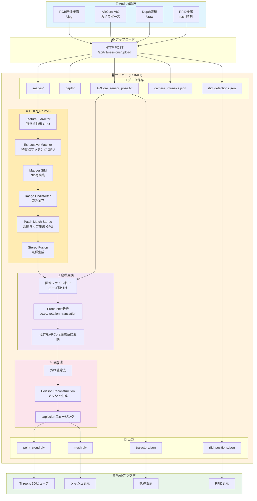
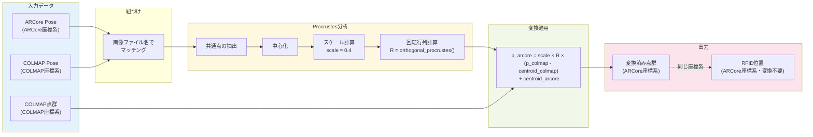
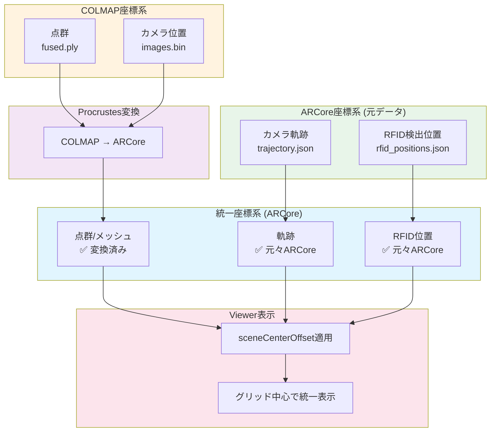

# ARCore vs COLMAP 座標系ガイド

## 概要

ARCoreとCOLMAPは異なる座標系を使用しており、データを統合する際には変換が必要です。

---

## 処理フローチャート

### 全体フロー（テキスト版）

```
┌─────────────────────────────────────────────────────────────────────────────┐
│                           Android端末                                        │
├─────────────────────────────────────────────────────────────────────────────┤
│                                                                             │
│   ┌─────────────┐    ┌─────────────┐    ┌─────────────┐    ┌──────────────┐│
│   │ RGB画像撮影  │    │ ARCore VIO  │    │ Depth取得   │    │ RFID検出     ││
│   │ (*.jpg)     │    │ (pose)      │    │ (*.raw)     │    │ (rssi,時刻)  ││
│   └──────┬──────┘    └──────┬──────┘    └──────┬──────┘    └──────┬───────┘│
│          │                  │                  │                   │        │
│          └──────────────────┼──────────────────┼───────────────────┘        │
│                             │                  │                            │
│                             ▼                  ▼                            │
│                    ┌────────────────────────────────────┐                   │
│                    │          HTTP POST Upload          │                   │
│                    │    /api/v1/sessions/upload         │                   │
│                    └────────────────┬───────────────────┘                   │
└─────────────────────────────────────┼───────────────────────────────────────┘
                                      │
                                      ▼
┌─────────────────────────────────────────────────────────────────────────────┐
│                           サーバー (FastAPI)                                 │
├─────────────────────────────────────────────────────────────────────────────┤
│                                                                             │
│   ┌─────────────────────────────────────────────────────────────────────┐   │
│   │                    データ保存 (data/sessions/{job_id}/)              │   │
│   │  ├── images/          # RGB画像                                     │   │
│   │  ├── depth/           # Depth画像（オプション）                      │   │
│   │  ├── ARCore_sensor_pose.txt    # ARCoreポーズ                       │   │
│   │  ├── camera_intrinsics.json    # カメラ内部パラメータ               │   │
│   │  └── rfid_detections.json      # RFID検出データ                     │   │
│   └─────────────────────────────────────────────────────────────────────┘   │
│                                      │                                      │
│                                      ▼                                      │
│   ┌─────────────────────────────────────────────────────────────────────┐   │
│   │                    COLMAP MVS パイプライン                           │   │
│   ├─────────────────────────────────────────────────────────────────────┤   │
│   │  1. Feature Extractor    ─→ 特徴点抽出 (GPU)                        │   │
│   │  2. Exhaustive Matcher   ─→ 特徴点マッチング (GPU)                  │   │
│   │  3. Mapper (SfM)         ─→ 3D再構築・カメラ位置推定                │   │
│   │  4. Image Undistorter    ─→ 歪み補正                                │   │
│   │  5. Patch Match Stereo   ─→ 密な深度マップ生成 (GPU)                │   │
│   │  6. Stereo Fusion        ─→ 点群生成 (COLMAP座標系)                 │   │
│   └─────────────────────────────────────────────────────────────────────┘   │
│                                      │                                      │
│                                      ▼                                      │
│   ┌─────────────────────────────────────────────────────────────────────┐   │
│   │                    座標変換 (COLMAP → ARCore)                        │   │
│   ├─────────────────────────────────────────────────────────────────────┤   │
│   │  1. 画像ファイル名でARCore/COLMAPポーズを紐づけ                     │   │
│   │  2. Procrustes分析で変換パラメータ計算                              │   │
│   │     - scale: ~0.4                                                   │   │
│   │     - rotation: 3x3回転行列                                         │   │
│   │     - translation: 重心オフセット                                   │   │
│   │  3. 点群をARCore座標系に変換                                        │   │
│   └─────────────────────────────────────────────────────────────────────┘   │
│                                      │                                      │
│                                      ▼                                      │
│   ┌─────────────────────────────────────────────────────────────────────┐   │
│   │                    後処理                                            │   │
│   ├─────────────────────────────────────────────────────────────────────┤   │
│   │  1. 統計的外れ値除去 (Statistical Outlier Removal)                  │   │
│   │  2. Poisson Surface Reconstruction (メッシュ生成)                   │   │
│   │  3. Laplacianスムージング                                           │   │
│   │  4. 小さな連結成分の除去                                            │   │
│   └─────────────────────────────────────────────────────────────────────┘   │
│                                      │                                      │
│                                      ▼                                      │
│   ┌─────────────────────────────────────────────────────────────────────┐   │
│   │                    出力 (results/{job_id}/)                          │   │
│   │  ├── point_cloud.ply     # 点群 (ARCore座標系)                      │   │
│   │  ├── mesh.ply            # メッシュ (ARCore座標系)                  │   │
│   │  ├── trajectory.json     # カメラ軌跡 (ARCore座標系)                │   │
│   │  └── rfid_positions.json # RFID位置 (ARCore座標系)                  │   │
│   └─────────────────────────────────────────────────────────────────────┘   │
│                                                                             │
└─────────────────────────────────────────────────────────────────────────────┘
                                      │
                                      ▼
┌─────────────────────────────────────────────────────────────────────────────┐
│                           Webブラウザ (Viewer)                               │
├─────────────────────────────────────────────────────────────────────────────┤
│                                                                             │
│   ┌─────────────────────────────────────────────────────────────────────┐   │
│   │                    Three.js 3Dビューア                               │   │
│   ├─────────────────────────────────────────────────────────────────────┤   │
│   │  1. メッシュ読み込み → 中心オフセット計算 (sceneCenterOffset)        │   │
│   │  2. 軌跡読み込み    → 同じオフセット適用                            │   │
│   │  3. RFID読み込み    → 同じオフセット適用                            │   │
│   │                                                                     │   │
│   │  結果: すべてグリッド中心で統一表示                                 │   │
│   └─────────────────────────────────────────────────────────────────────┘   │
│                                                                             │
└─────────────────────────────────────────────────────────────────────────────┘
```

### Mermaid フローチャート



### 座標変換の詳細フロー



### RFIDと3Dモデルの座標統一



---

## 1. ARCore座標系

### 特徴
- **原点**: セッション開始時のデバイス位置
- **Y軸**: 重力方向の逆（上向き）
- **X軸**: デバイスの右方向
- **Z軸**: デバイスの後ろ方向（カメラが向いている方向の逆）
- **単位**: メートル
- **右手座標系**

### 自己位置推定方式
- **VIO (Visual-Inertial Odometry)**: カメラ画像 + IMU（加速度計・ジャイロスコープ）
- **特徴点追跡**: 環境の特徴点を追跡してカメラ移動を推定
- **IMU積分**: 慣性センサーで短期間の動きを補完
- **ドリフト補正**: ループクロージャで累積誤差を修正

### 実測値（1611626eセッション）
```
フレーム数: 209
X範囲: [-0.025, 3.802]m  (水平移動: 約3.8m)
Y範囲: [-0.239, 0.188]m  (高さ変動: 約0.4m) ← 重力方向
Z範囲: [-1.857, 1.261]m  (前後移動: 約3.1m)
開始位置: (0.220, 0.077, 0.098)  ← ほぼ原点
```

### 利点
- リアルタイム処理（30-60fps）
- 重力方向が正確（IMUにより）
- 端末のみで完結
- 低レイテンシ

### 欠点
- 長時間でドリフト蓄積
- テクスチャの少ない環境で精度低下

---

## 2. COLMAP座標系

### 特徴
- **原点**: 任意（最初の画像または最適化結果による）
- **軸方向**: 重力方向との関係は保証されない
- **スケール**: Structure from Motion (SfM) では相対スケールのみ
- **単位**: 任意（外部情報がないとメートル単位にならない）

### 自己位置推定方式
- **SfM (Structure from Motion)**: 画像のみから3D構造とカメラ位置を同時推定
- **特徴点検出**: SIFT等で画像から特徴点を抽出
- **特徴点マッチング**: 画像間で対応点を見つける
- **バンドル調整**: 全カメラ・全3D点を同時最適化

### 実測値（1611626eセッション）
```
登録画像数: 164 (209枚中、78%が登録成功)
X範囲: [-4.077, 1.199]m
Y範囲: [-3.359, 2.893]m
Z範囲: [-4.792, 5.069]m
```

### 利点
- 高精度な相対位置
- 画像のみで動作（IMU不要）
- オフライン最適化で一貫性が高い

### 欠点
- 処理時間が長い（数分〜数十分）
- 絶対スケールが不明
- 重力方向が不明
- 特徴点不足で失敗しやすい

---

## 3. 座標系の違い（実データ比較）

| 項目 | ARCore | COLMAP |
|------|--------|--------|
| 原点 | セッション開始位置 | 最適化結果による |
| Y軸 | 重力方向（上が正） | 不定 |
| スケール | メートル（実寸） | 相対（不定） |
| 移動範囲X | 3.8m | 5.3m |
| 移動範囲Y | 0.4m | 6.3m |
| 移動範囲Z | 3.1m | 9.9m |

### 図解

```
ARCore座標系:
      Y (上)
      |
      |
      +------ X (右)
     /
    Z (後ろ)
    
    * 重力方向が常にY軸負方向
    * セッション開始位置が原点

COLMAP座標系:
    ? 
    |
    |
    +------ ?
   /
  ?
  
  * 軸方向は最適化結果に依存
  * スケールも不定
```

---

## 4. 座標系統合の方法

### 方法1: ARCoreポーズをCOLMAPに提供（現在の実装）
1. ARCoreの画像とポーズをCOLMAPにインポート
2. COLMAPのSfMをスキップし、ARCoreポーズを初期値として使用
3. Dense MVS（Patch Match Stereo）で深度推定
4. 結果はARCore座標系に近い

**問題点**: COLMAPのSfMは独自に最適化するため、ARCoreポーズと乖離する可能性

### 方法2: 座標変換行列を計算
1. 両方の座標系でカメラ位置を取得
2. 対応点からRigid Transformation（回転+並進+スケール）を計算
3. COLMAP結果をARCore座標系に変換

```python
# Procrustes分析で変換行列を計算
from scipy.spatial import procrustes
mtx1, mtx2, disparity = procrustes(arcore_positions, colmap_positions)
```

### 方法3: RGBDパイプライン（ARCore Depth使用）
1. ARCoreのRGB画像 + Depth画像を使用
2. ARCoreポーズでTSDF統合
3. 結果は完全にARCore座標系

**利点**: 座標系の問題がない、RFIDタグ位置が正確

---

## 5. RFIDタグ位置の扱い

### RFIDタグ検出のデータ構造
```json
{
  "detections": [
    {
      "tag_id": "E280...",
      "timestamp": 1234567890,
      "rssi": -45,
      "frame_index": 100,
      "camera_position": {"x": 1.5, "y": 0.1, "z": -0.5}
    }
  ]
}
```

### 座標系の重要性
- `camera_position`はARCore座標系で記録される
- 点群/メッシュもARCore座標系であればタグ位置が正確に表示可能
- COLMAP座標系の場合、変換が必要

---

## 6. 推奨アプローチ

### ケース1: ARCore Depth APIが利用可能な場合
**→ RGBDパイプラインを使用**
- 座標系変換が不要
- 高密度な点群
- RFIDタグ位置が正確

### ケース2: ARCore Depth APIが利用不可の場合
**→ COLMAP MVS + 座標変換**
1. COLMAPで3D再構成
2. ARCore-COLMAP間の座標変換行列を計算
3. 結果をARCore座標系に変換
4. RFIDタグ位置と統合

---

## 7. 実データによる座標系対応分析

### 軸の対応関係（相関分析結果）
```
ARCore X ↔ COLMAP Z: 相関 = 0.984  ★強い正の相関
ARCore X ↔ COLMAP Y: 相関 = -0.953 ★強い負の相関
ARCore Z ↔ COLMAP Y: 相関 = 0.954  ★強い正の相関
ARCore Z ↔ COLMAP Z: 相関 = -0.914 ★強い負の相関
```

### 座標軸マッピング（推定）
| ARCore | COLMAP | 関係 |
|--------|--------|------|
| X (右) | Z (?) | 正の相関 |
| Y (上) | ? | 弱い相関 |
| Z (後) | Y (?) | 正の相関 |

### スケールの違い
```
移動範囲:
  ARCore: X=3.79m, Y=0.40m, Z=2.92m → 総距離 4.80m
  COLMAP: X=5.28m, Y=6.25m, Z=9.86m → 総距離 12.81m

スケール比: COLMAP / ARCore = 2.67倍
```

**重要**: COLMAPの座標系はARCoreの約2.7倍にスケーリングされている

### カメラ位置の例
| 画像 | ARCore (X,Y,Z) | COLMAP (X,Y,Z) |
|------|----------------|----------------|
| frame_176359... | (0.22, 0.08, 0.10) | (-1.92, 1.41, -3.35) |
| frame_176360... | (0.23, 0.09, 0.16) | (-1.80, 1.44, -3.43) |

### 座標変換の必要性
COLMAPの結果をARCore座標系に変換するには：
1. **回転**: 軸の入れ替え + 符号反転
2. **スケーリング**: 約0.37倍 (1/2.67)
3. **並進**: オフセット調整

---

## 8. 現在のデータ分析

### backup/pointcloud.ply の特徴
```
点数: 240,432
範囲: X=[-3, 3]m, Y=[-3, 3]m, Z=[-3, 3]m
原点からの最大距離: 3.00m
```
→ **原点から3m以内でフィルタリング済み**
→ 座標系は正規化されている可能性が高い

### 問題点
1. COLMAPのスケールがARCoreと異なる（約2.7倍）
2. 軸の向きも異なる（回転が必要）
3. RFIDタグ位置はARCore座標系で記録されている

---

## 9. 推奨される解決策

### 解決策A: ARCore座標系でCOLMAPを実行（推奨）
1. COLMAPにARCoreポーズを初期値として与える
2. バンドル調整で最適化しつつ、スケールを固定
3. 結果がARCore座標系に近くなる

### 解決策B: 座標変換行列を計算
```python
# Procrustes分析で変換を計算
from scipy.linalg import orthogonal_procrustes

# ARCoreとCOLMAPの対応点
arcore_pts = np.array([...])  # (N, 3)
colmap_pts = np.array([...])  # (N, 3)

# 中心化
arcore_centered = arcore_pts - arcore_pts.mean(axis=0)
colmap_centered = colmap_pts - colmap_pts.mean(axis=0)

# 最適回転行列
R, _ = orthogonal_procrustes(colmap_centered, arcore_centered)

# スケール
scale = np.linalg.norm(arcore_centered) / np.linalg.norm(colmap_centered)

# 変換適用
colmap_transformed = scale * (colmap_pts @ R) + offset
```

### 解決策C: RGBDパイプライン使用（最も簡単）
- ARCore Depth APIを使用
- 座標系変換が不要
- RFIDタグ位置と完全に一致

---

## 10. 実装済み: COLMAP ↔ ARCore ポーズ紐づけ

### 紐づけの仕組み

COLMAPとARCoreのカメラポーズは、**画像ファイル名**で紐づけられます。

```
ARCoreデータ                          COLMAPデータ
─────────────────────────────────────────────────────────────
ARCore_sensor_pose.txt                colmap/sparse/0/images.bin
─────────────────────────────────────────────────────────────
frame_176359940065365.jpg             frame_176359940065365.jpg
  → ARCore pose (tx, ty, tz, qw...)     → COLMAP pose (tx', ty', tz', qw'...)
frame_176360140068874.jpg             frame_176360140068874.jpg
  → ARCore pose                          → COLMAP pose
...                                    ...
─────────────────────────────────────────────────────────────
```

### 変換パラメータの計算 (`_compute_colmap_to_arcore_transform`)

```python
def _compute_colmap_to_arcore_transform(parser, colmap_dir):
    # 1. ARCoreカメラ位置を取得
    arcore_data = {}
    for frame in parser.frames:
        if frame.pose and frame.image_path:
            pose_matrix = frame.pose.to_matrix()
            position = pose_matrix[:3, 3]
            arcore_data[frame.image_path.name] = position
    
    # 2. COLMAPカメラ位置を取得（images.bin）
    colmap_data = read_colmap_images(colmap_dir / "sparse/0")
    
    # 3. 共通画像でProcrustes分析
    common_images = set(arcore_data.keys()) & set(colmap_data.keys())
    
    arcore_pts = np.array([arcore_data[img] for img in common_images])
    colmap_pts = np.array([colmap_data[img] for img in common_images])
    
    # 4. 中心化
    arcore_centroid = arcore_pts.mean(axis=0)
    colmap_centroid = colmap_pts.mean(axis=0)
    
    # 5. スケール計算
    scale = arcore_scale / colmap_scale  # 典型値: ~0.4
    
    # 6. 最適回転行列
    R, _ = orthogonal_procrustes(colmap_normalized, arcore_normalized)
    
    return {
        'scale': scale,
        'rotation': R,
        'colmap_centroid': colmap_centroid,
        'arcore_centroid': arcore_centroid
    }
```

### 点群の変換

```python
def _transform_points_to_arcore(points, transform):
    """COLMAP座標系の点群をARCore座標系に変換"""
    scale = transform['scale']
    R = transform['rotation']
    colmap_centroid = transform['colmap_centroid']
    arcore_centroid = transform['arcore_centroid']
    
    # 変換式:
    # p_arcore = scale × R × (p_colmap - colmap_centroid) + arcore_centroid
    centered = points - colmap_centroid
    transformed = scale * (centered @ R) + arcore_centroid
    return transformed
```

### 変換パラメータの例（実データ）

`colmap_to_arcore_transform.json`:
```json
{
    "scale": 0.4124,
    "rotation": [
        [0.498, 0.107, 0.861],
        [-0.363, -0.876, 0.318],
        [0.788, -0.471, -0.397]
    ],
    "colmap_centroid": [-0.129, -0.074, 0.034],
    "arcore_centroid": [2.083, 0.014, -0.079]
}
```

---

## 11. RFIDタグの座標について

### 重要: RFIDは変換不要

RFIDタグの位置は**最初からARCore座標系**で記録されています。

```
┌─────────────────────────────────────────────────────────────┐
│                    データの流れ                              │
├─────────────────────────────────────────────────────────────┤
│                                                             │
│  [Android端末]                                               │
│       │                                                     │
│       ├─→ ARCore VIO ─→ カメラ位置 (ARCore座標)             │
│       │                        │                            │
│       │                        ▼                            │
│       │                 RFID検出時の位置                     │
│       │                        │                            │
│       │                        ▼                            │
│       │                 rfid_detections.json                │
│       │                 (ARCore座標系)                       │
│       │                                                     │
│       └─→ 画像撮影 ─→ COLMAP処理 ─→ メッシュ               │
│                              │                              │
│                              ▼                              │
│                     Procrustes変換                          │
│                              │                              │
│                              ▼                              │
│                     mesh.ply (ARCore座標系)                 │
│                                                             │
└─────────────────────────────────────────────────────────────┘
```

### 最終出力（すべてARCore座標系）

| ファイル | 座標系 | 変換 |
|----------|--------|------|
| `mesh.ply` | ARCore | COLMAP → ARCore変換済み |
| `point_cloud.ply` | ARCore | COLMAP → ARCore変換済み |
| `trajectory.json` | ARCore | 元々ARCore座標 |
| `rfid_positions.json` | ARCore | 元々ARCore座標（変換不要）|

### Viewerでの表示

```javascript
// viewer.html での座標処理

// 1. メッシュ読み込み時: 中心オフセットを計算・保存
const boundingBox = new THREE.Box3().setFromObject(mesh);
sceneCenterOffset = boundingBox.getCenter(new THREE.Vector3());
mesh.position.sub(sceneCenterOffset);

// 2. 軌跡読み込み時: 同じオフセットを適用
trajectory.forEach(pose => {
    marker.position.set(
        pose.x - sceneCenterOffset.x,
        pose.y - sceneCenterOffset.y,
        pose.z - sceneCenterOffset.z
    );
});

// 3. RFID読み込み時: 同じオフセットを適用
rfidMarker.position.set(
    pos.x - sceneCenterOffset.x,
    pos.y - sceneCenterOffset.y,
    pos.z - sceneCenterOffset.z
);
```

これにより、メッシュ・軌跡・RFIDがすべてグリッド中心で統一表示されます。

---

## 12. 次のステップ

1. ~~**解決策の選択**: RGBDパイプラインが利用可能ならそれを使用~~ → MVS + 座標変換を実装済み
2. ~~**座標変換の実装**: MVS使用時は変換行列を計算~~ → Procrustes分析で実装済み
3. **RFIDタグ位置の検証**: Viewerでタグ位置が正しいか確認（テストデータが必要）
4. **距離フィルタの適用**: カメラから3m以内の点群を抽出（config.yamlで設定可能）

---

## 参考資料

- [ARCore Coordinate System](https://developers.google.com/ar/develop/fundamentals)
- [COLMAP Documentation](https://colmap.github.io/)
- [Open3D Coordinate System](http://www.open3d.org/docs/)
- [Procrustes Analysis (scipy)](https://docs.scipy.org/doc/scipy/reference/generated/scipy.linalg.orthogonal_procrustes.html)

---
最終更新: 2026-01-09

