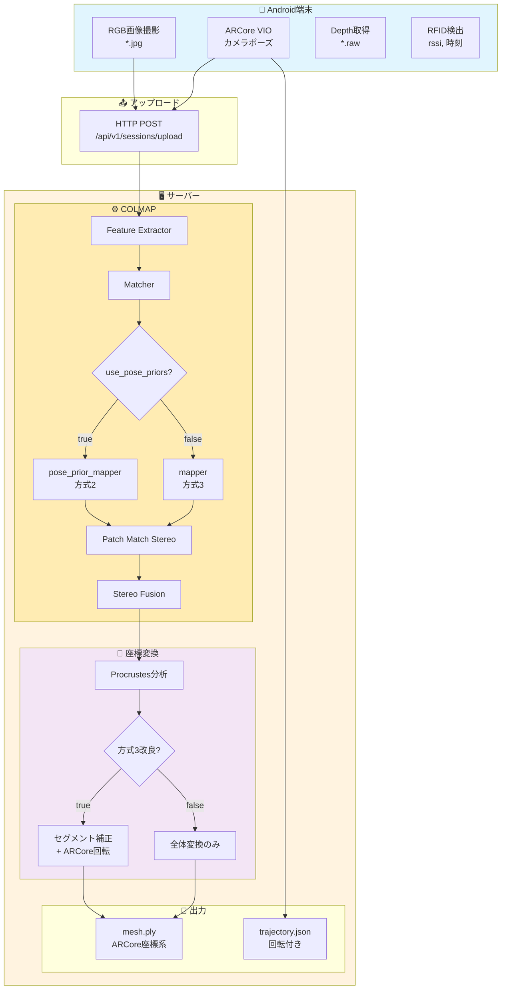

# ARCore vs COLMAP 座標系ガイド

**作成日時:** 2026-01-09 16:00:00  
**更新日時:** 2026-01-09 16:00:00  
**ステータス:** 実装完了

---

## 概要

ARCoreとCOLMAPは異なる座標系を使用しており、データを統合する際には変換が必要です。
本ドキュメントでは座標系の違い、変換方法、および実装済みの位置合わせ方式について説明します。

---

## 実装済み方式一覧

| 方式 | 概要 | 位置精度 | 回転精度 | メッシュ品質 | config.yaml設定 |
|------|------|---------|---------|-------------|----------------|
| **方式2** | pose_prior_mapper | 0.55m | 55° | ✅ 綺麗 | `use_pose_priors: true` |
| **方式3** | セグメント補正 | 0.14m | 55° | 若干歪み | `use_pose_priors: false` |
| **方式3改良** | 方式3 + ARCore回転 | **0.14m** | **≈2°** | 若干歪み | `use_arcore_rotation: true` |

---

## 処理フローチャート

### 全体フロー（テキスト版）

```
┌─────────────────────────────────────────────────────────────────────────────┐
│                           Android端末                                        │
├─────────────────────────────────────────────────────────────────────────────┤
│                                                                             │
│   ┌─────────────┐    ┌─────────────┐    ┌─────────────┐    ┌──────────────┐│
│   │ RGB画像撮影  │    │ ARCore VIO  │    │ Depth取得   │    │ RFID検出     ││
│   │ (*.jpg)     │    │ (pose)      │    │ (*.raw)     │    │ (rssi,時刻)  ││
│   └──────┬──────┘    └──────┬──────┘    └──────┬──────┘    └──────┬───────┘│
│          │                  │                  │                   │        │
│          └──────────────────┼──────────────────┼───────────────────┘        │
│                             │                  │                            │
│                             ▼                  ▼                            │
│                    ┌────────────────────────────────────┐                   │
│                    │          HTTP POST Upload          │                   │
│                    │    /api/v1/sessions/upload         │                   │
│                    └────────────────┬───────────────────┘                   │
└─────────────────────────────────────┼───────────────────────────────────────┘
                                      │
                                      ▼
┌─────────────────────────────────────────────────────────────────────────────┐
│                           サーバー (FastAPI)                                 │
├─────────────────────────────────────────────────────────────────────────────┤
│                                                                             │
│   ┌─────────────────────────────────────────────────────────────────────┐   │
│   │                    COLMAP MVS パイプライン                           │   │
│   ├─────────────────────────────────────────────────────────────────────┤   │
│   │  1. Feature Extractor    ─→ 特徴点抽出 (GPU)                        │   │
│   │  2. Matcher              ─→ 特徴点マッチング (GPU)                  │   │
│   │  【方式2】pose_prior_mapper ─→ ARCore拘束付きSfM                    │   │
│   │  【方式3】mapper           ─→ 通常SfM                               │   │
│   │  4. Image Undistorter    ─→ 歪み補正                                │   │
│   │  5. Patch Match Stereo   ─→ 密な深度マップ生成 (GPU)                │   │
│   │  6. Stereo Fusion        ─→ 点群生成 (COLMAP座標系)                 │   │
│   └─────────────────────────────────────────────────────────────────────┘   │
│                                      │                                      │
│                                      ▼                                      │
│   ┌─────────────────────────────────────────────────────────────────────┐   │
│   │                    座標変換 (COLMAP → ARCore)                        │   │
│   ├─────────────────────────────────────────────────────────────────────┤   │
│   │  1. 画像ファイル名でARCore/COLMAPポーズを紐づけ                     │   │
│   │  2. Procrustes分析で変換パラメータ計算                              │   │
│   │     - scale: ~0.1-0.4                                              │   │
│   │     - rotation: 3x3回転行列                                         │   │
│   │     - translation: 重心オフセット                                   │   │
│   │  3. 点群/メッシュをARCore座標系に変換                               │   │
│   │  【方式3改良】セグメント別局所補正 + ARCore回転使用                  │   │
│   └─────────────────────────────────────────────────────────────────────┘   │
│                                      │                                      │
│                                      ▼                                      │
│   ┌─────────────────────────────────────────────────────────────────────┐   │
│   │                    出力 (results/{job_id}/)                          │   │
│   │  ├── point_cloud.ply     # 点群 (ARCore座標系)                      │   │
│   │  ├── mesh.ply            # メッシュ (ARCore座標系)                  │   │
│   │  ├── trajectory.json     # カメラ軌跡 (ARCore座標系, 回転付き)      │   │
│   │  └── colmap_to_arcore_transform.json  # 変換パラメータ              │   │
│   └─────────────────────────────────────────────────────────────────────┘   │
│                                                                             │
└─────────────────────────────────────────────────────────────────────────────┘
```

### Mermaid フローチャート



---

## 1. ARCore座標系

### 特徴
- **原点**: セッション開始時のデバイス位置
- **Y軸**: 重力方向の逆（上向き）
- **X軸**: デバイスの右方向
- **Z軸**: デバイスの後ろ方向（カメラが向いている方向の逆）
- **単位**: メートル
- **右手座標系**

### クォータニオン形式
- **内部形式**: `[qw, qx, qy, qz]` （CameraPose.quaternion）
- **保存形式**: `[qx, qy, qz, qw]` （trajectory.json、scipy/Three.js標準）

```python
# CameraPose.quaternion は [qw, qx, qy, qz]
quat = frame.pose.quaternion
# [qx, qy, qz, qw] に変換して保存
quat_xyzw = [quat[1], quat[2], quat[3], quat[0]]
```

### 自己位置推定方式
- **VIO (Visual-Inertial Odometry)**: カメラ画像 + IMU
- **精度**: 位置 ~数cm、回転 ~1-3°

---

## 2. COLMAP座標系

### 特徴
- **原点**: 任意（最適化結果による）
- **軸方向**: 重力方向との関係は保証されない
- **スケール**: 相対スケールのみ（メートル単位ではない）

### 自己位置推定方式
- **SfM (Structure from Motion)**: 画像のみから推定
- **精度**: 相対位置は高精度、絶対位置は不明

---

## 3. 座標変換の実装

### Procrustes分析

```python
def _compute_colmap_to_arcore_transform(parser, colmap_dir):
    # 1. 画像ファイル名で対応点を取得
    arcore_pts = []  # ARCoreカメラ位置
    colmap_pts = []  # COLMAPカメラ位置
    
    # 2. 中心化
    arcore_centroid = arcore_pts.mean(axis=0)
    colmap_centroid = colmap_pts.mean(axis=0)
    
    # 3. スケール計算
    scale = arcore_scale / colmap_scale
    
    # 4. 最適回転行列
    R, _ = orthogonal_procrustes(colmap_normalized, arcore_normalized)
    
    return {'scale': scale, 'rotation': R, ...}
```

### 点群変換

```python
def _transform_points_to_arcore(points, transform):
    """COLMAP座標系 → ARCore座標系"""
    # p_arcore = scale × R × (p_colmap - centroid_colmap) + centroid_arcore
    centered = points - transform['colmap_centroid']
    transformed = transform['scale'] * (centered @ transform['rotation']) + transform['arcore_centroid']
    return transformed
```

---

## 4. 方式別の実装詳細

### 方式2: pose_prior_mapper

ARCoreポーズを**ソフト拘束**としてCOLMAP SfMに提供。

```yaml
# config.yaml
colmap:
  use_pose_priors: true
  pose_prior:
    position_std_x: 0.1  # 10cm
    position_std_y: 0.1
    position_std_z: 0.1
```

**処理フロー:**
1. ARCoreポーズをCOLMAP座標系に変換（Y, Z反転）
2. `pose_priors`テーブルに挿入
3. `pose_prior_mapper`でSfM実行
4. Procrustes分析で座標変換

**長所:** メッシュが綺麗（歪みなし）
**短所:** 位置精度0.55m、スケール比1.69x

### 方式3: 通常SfM + セグメント補正

```yaml
# config.yaml
colmap:
  use_pose_priors: false
alignment:
  segment_correction:
    enable: true
    segment_duration_sec: 2.0
```

**処理フロー:**
1. 通常のCOLMAP SfMを実行
2. Procrustes分析で全体変換
3. 2秒セグメントごとに局所並進補正

**長所:** 位置精度0.14m
**短所:** メッシュに若干の歪み

### 方式3改良: ARCore回転使用

```yaml
# config.yaml
alignment:
  use_arcore_rotation: true
```

**処理フロー:**
1. 方式3の処理を実行
2. 軌跡の回転をARCore回転で置換

**長所:** 回転精度≈2°（COLMAP: 55°）
**短所:** メッシュに若干の歪み

---

## 5. 軌跡データ形式

### trajectory.json

```json
{
  "poses": [
    {
      "position": {"x": 0.15, "y": 0.21, "z": 0.22},
      "rotation": [0.14, 0.20, 0.21, 0.94],
      "timestamp": 79274840173634
    }
  ],
  "count": 294,
  "coordinate_system": "arcore",
  "rotation_format": "quaternion_xyzw"
}
```

**重要:** `rotation`は`[qx, qy, qz, qw]`形式（scipy/Three.js標準）

### 回転の前方向ベクトル計算

```python
from scipy.spatial.transform import Rotation as R

quat = pose['rotation']  # [qx, qy, qz, qw]
rot = R.from_quat(quat)
forward = rot.apply([0, 0, -1])  # カメラ前方向
```

---

## 6. RFIDタグの座標

### 重要: RFIDは変換不要

RFIDタグ位置は**最初からARCore座標系**で記録されています。

```
ARCore VIO → カメラ位置 (ARCore座標) → RFID検出位置 (ARCore座標)
```

### 最終出力（すべてARCore座標系）

| ファイル | 座標系 | 変換 |
|----------|--------|------|
| `mesh.ply` | ARCore | COLMAP → ARCore変換済み |
| `trajectory.json` | ARCore | 元々ARCore座標 |
| `rfid_positions.json` | ARCore | 元々ARCore（変換不要）|

---

## 7. Viewer表示

### 座標オフセット処理

```javascript
// 1. メッシュ読み込み時: 中心オフセットを計算
const boundingBox = new THREE.Box3().setFromObject(mesh);
sceneCenterOffset = boundingBox.getCenter(new THREE.Vector3());
mesh.position.sub(sceneCenterOffset);

// 2. 軌跡/RFIDにも同じオフセットを適用
marker.position.set(
    pose.x - sceneCenterOffset.x,
    pose.y - sceneCenterOffset.y,
    pose.z - sceneCenterOffset.z
);
```

### 向き矢印の表示

```javascript
// クォータニオンから前方向ベクトルを計算
const quaternion = new THREE.Quaternion(q[0], q[1], q[2], q[3]);
const forward = new THREE.Vector3(0, 0, -1).applyQuaternion(quaternion);

// ArrowHelperで表示
const arrow = new THREE.ArrowHelper(forward, position, 0.15, color);
```

---

## 8. 変換パラメータの例

### colmap_to_arcore_transform.json

```json
{
  "scale": 0.1180,
  "rotation": [
    [0.498, 0.107, 0.861],
    [-0.363, -0.876, 0.318],
    [0.788, -0.471, -0.397]
  ],
  "colmap_centroid": [-0.129, -0.074, 0.034],
  "arcore_centroid": [2.083, 0.014, -0.079],
  "mean_error": 0.550,
  "median_error": 0.429
}
```

---

## 9. 推奨設定

### RFIDタグ位置精度重視

```yaml
colmap:
  use_pose_priors: false
alignment:
  segment_correction:
    enable: true
    segment_duration_sec: 2.0
  use_arcore_rotation: true
```

**結果:** 2m先のRFID誤差 ≈ 0.21m

### メッシュ品質重視

```yaml
colmap:
  use_pose_priors: true
  pose_prior:
    position_std_x: 0.1
    position_std_y: 0.1
    position_std_z: 0.1
```

**結果:** 歪みのない綺麗なメッシュ

---

## 参考資料

- [ARCore Coordinate System](https://developers.google.com/ar/develop/fundamentals)
- [COLMAP Documentation](https://colmap.github.io/)
- [scipy.spatial.transform.Rotation](https://docs.scipy.org/doc/scipy/reference/generated/scipy.spatial.transform.Rotation.html)
- [Three.js Quaternion](https://threejs.org/docs/#api/en/math/Quaternion)

---

## 関連ドキュメント

- `docs/20260109_130002_ALIGNMENT_METHODS_INVESTIGATION.md` - 位置合わせ方式の詳細調査
- `docs/20260109_130200_METHOD2_IMPLEMENTATION_PLAN.md` - 方式2の実装計画
- `docs/PIPELINE_COORDINATE_SYSTEM.md` - パイプライン座標系の詳細

---
最終更新: 2026-01-09 16:00:00

