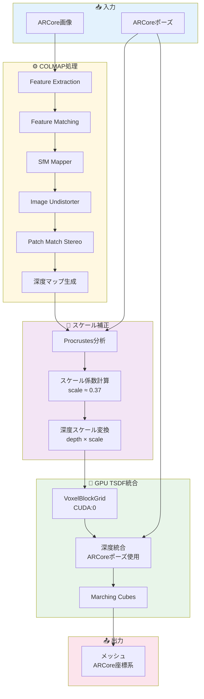
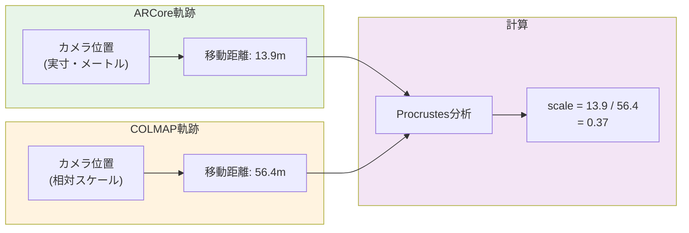
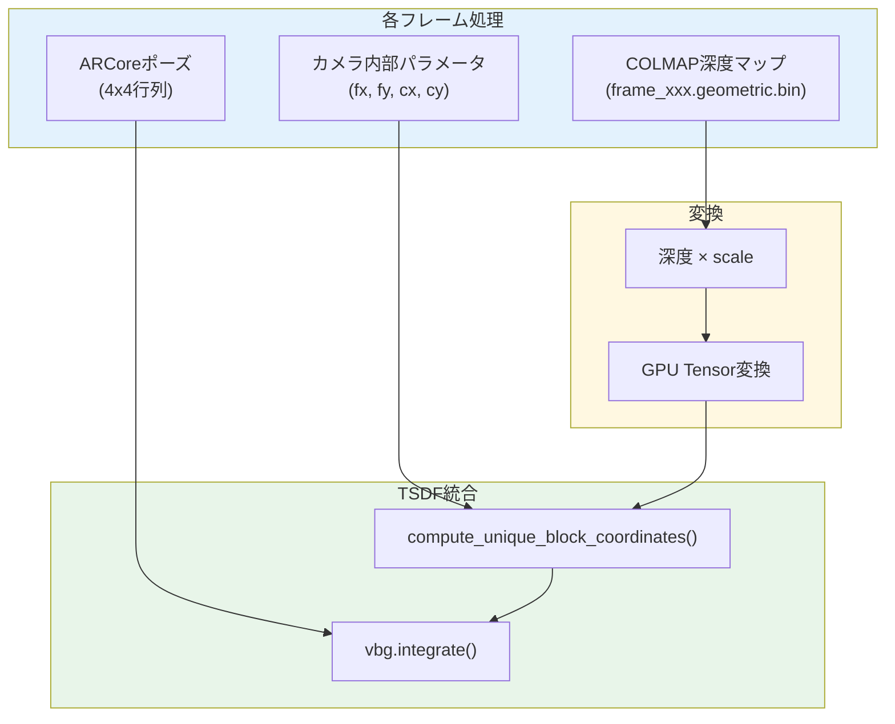

# 方法C: スケール補正付きCOLMAP深度統合

## 概要

ARCore Depth API（Pixel端末）の深度は10-20cmの誤差があり、メッシュが凸凹になる問題があります。
本手法では、COLMAPの滑らかな深度マップを活用しつつ、ARCoreの正確な位置姿勢情報を使用することで、
「部屋っぽく見える」かつ「座標系が正確」なメッシュを生成します。

---

## 問題点の整理

### 各深度ソースの特性

| 項目 | ARCore Depth (Pixel) | COLMAP MVS |
|------|---------------------|------------|
| 深度精度 | △ 10-20cm誤差 | ○ 相対的に良好 |
| 幾何的一貫性 | × ノイジー | ✓ 滑らか |
| 座標系 | ✓ 正確（メートル、重力方向） | × 独自座標系 |
| スケール | ✓ 実寸 | × 相対スケール |
| 見た目 | × 凸凹 | ✓ 部屋っぽい |

### 従来手法の課題

```
┌─────────────────────────────────────────────────────────────┐
│  ARCore Depth のみ使用                                      │
│  → メッシュが凸凹、見た目が悪い                             │
├─────────────────────────────────────────────────────────────┤
│  COLMAP MVS のみ使用                                        │
│  → 座標系が不正確、RFIDとの整合が取れない (誤差0.3-0.6m)   │
└─────────────────────────────────────────────────────────────┘
```

---

## 方法Cのアプローチ

### コンセプト

```
┌─────────────────────────────────────────────────────────────┐
│                    深度と位置姿勢の分離                      │
├─────────────────────────────────────────────────────────────┤
│                                                             │
│  深度（表面形状）← COLMAP                                   │
│    - 滑らかで一貫性がある                                   │
│    - 部屋の形が正しく見える                                 │
│                                                             │
│  位置姿勢       ← ARCore                                    │
│    - VIOによる高精度ポーズ                                  │
│    - 重力方向が正確                                         │
│    - メートル単位                                           │
│                                                             │
│  統合手法       ← GPU TSDF                                  │
│    - 深度とポーズを3Dモデルに統合                           │
│    - GPU加速で高速処理                                      │
│                                                             │
└─────────────────────────────────────────────────────────────┘
```

### 処理フロー

```
┌─────────────────────────────────────────────────────────────┐
│              方法C パイプライン                              │
├─────────────────────────────────────────────────────────────┤
│                                                             │
│  入力: ARCore画像 + ポーズ                                  │
│           │                                                 │
│           ▼                                                 │
│  ┌─────────────────────────────────────────────────────┐    │
│  │ COLMAP処理                                          │    │
│  │   Feature Extraction → Matching → SfM → MVS        │    │
│  │                                                     │    │
│  │   出力: 深度マップ (dense/stereo/depth_maps/*.bin) │    │
│  │         ※COLMAPのポーズは使わない                  │    │
│  └─────────────────────────────────────────────────────┘    │
│           │                                                 │
│           ▼                                                 │
│  ┌─────────────────────────────────────────────────────┐    │
│  │ スケール係数の計算 (Procrustes分析)                 │    │
│  │                                                     │    │
│  │   scale = ARCoreカメラ移動距離 / COLMAPカメラ移動距離│    │
│  │         ≈ 0.25 〜 0.45 (データ依存)                │    │
│  └─────────────────────────────────────────────────────┘    │
│           │                                                 │
│           ▼                                                 │
│  ┌─────────────────────────────────────────────────────┐    │
│  │ COLMAP深度のスケール補正                            │    │
│  │                                                     │    │
│  │   depth_scaled = depth_colmap × scale              │    │
│  │                                                     │    │
│  │   例: 壁までの距離                                  │    │
│  │       COLMAP: 2.7m → × 0.37 → 1.0m (実寸)         │    │
│  └─────────────────────────────────────────────────────┘    │
│           │                                                 │
│    ┌──────┴──────┐                                          │
│    │             │                                          │
│    ▼             ▼                                          │
│  ┌───────┐   ┌───────┐                                      │
│  │COLMAP │   │ARCore │                                      │
│  │深度   │   │ポーズ │                                      │
│  │(補正) │   │       │                                      │
│  └───┬───┘   └───┬───┘                                      │
│      │           │                                          │
│      └─────┬─────┘                                          │
│            │                                                │
│            ▼                                                │
│  ┌─────────────────────────────────────────────────────┐    │
│  │ GPU TSDF Volume (VoxelBlockGrid)                    │    │
│  │                                                     │    │
│  │   for each frame:                                   │    │
│  │     vbg.integrate(                                  │    │
│  │       depth = colmap_depth_scaled,  ← 深度はCOLMAP │    │
│  │       pose = arcore_pose            ← ポーズはARCore│    │
│  │     )                                               │    │
│  │                                                     │    │
│  │   voxel_size = 1cm                                  │    │
│  │   device = CUDA:0                                   │    │
│  └─────────────────────────────────────────────────────┘    │
│            │                                                │
│            ▼                                                │
│  ┌─────────────────────────────────────────────────────┐    │
│  │ Marching Cubes (メッシュ抽出)                       │    │
│  │                                                     │    │
│  │   mesh = vbg.extract_triangle_mesh()               │    │
│  └─────────────────────────────────────────────────────┘    │
│            │                                                │
│            ▼                                                │
│  出力: メッシュ (ARCore座標系)                              │
│                                                             │
│    - 形状: COLMAP深度由来 → 滑らか、部屋っぽい             │
│    - 座標: ARCoreポーズ由来 → RFIDと一致                   │
│                                                             │
└─────────────────────────────────────────────────────────────┘
```

---

## スケール係数の計算

### 原理

COLMAPのSfMは「相対スケール」しか持たないため、実寸に変換する必要があります。
ARCoreのVIOは実寸（メートル単位）なので、両者のカメラ軌跡を比較してスケール係数を算出します。

### 計算方法 (Procrustes分析)

```python
# 1. 共通画像のカメラ位置を取得
#    (画像ファイル名でARCoreとCOLMAPを紐付け)
arcore_pts = [ARCoreのカメラ位置]  # N点
colmap_pts = [COLMAPのカメラ位置]  # N点

# 2. 各点群の重心を計算
arcore_centroid = arcore_pts.mean(axis=0)
colmap_centroid = colmap_pts.mean(axis=0)

# 3. 重心からの距離（広がり）を計算
arcore_centered = arcore_pts - arcore_centroid
colmap_centered = colmap_pts - colmap_centroid

arcore_scale = sqrt(sum(arcore_centered²))
colmap_scale = sqrt(sum(colmap_centered²))

# 4. スケール係数
scale = arcore_scale / colmap_scale
```

### 実測値の例

| データセット | ARCore移動距離 | COLMAP移動距離 | スケール係数 |
|-------------|---------------|----------------|-------------|
| 6d24a96e | 13.92m | 56.39m | 0.37 |
| 1611626e | 4.80m | 12.81m | 0.41 |

---

## COLMAP深度マップの読み込み

### ファイル形式

```
colmap/dense/stereo/depth_maps/
  ├── frame_xxxxx.geometric.bin   ← 使用
  └── frame_xxxxx.photometric.bin
```

### 読み込みコード

```python
import struct
import numpy as np

def read_colmap_depth_map(path):
    """COLMAP深度マップを読み込み"""
    with open(path, 'rb') as f:
        # ヘッダー: width, height, channels, depth_min, depth_max
        width, height, channels = struct.unpack('iii', f.read(12))
        
        # 深度データ (float32)
        depth = np.frombuffer(f.read(), dtype=np.float32)
        depth = depth.reshape(height, width)
        
    return depth

# スケール補正
depth_scaled = depth * scale_factor
```

---

## GPU TSDF統合

### Open3D VoxelBlockGrid の使用

```python
import open3d as o3d
import open3d.core as o3c

# GPU TSDF Volume 作成
device = o3c.Device("CUDA:0")
vbg = o3d.t.geometry.VoxelBlockGrid(
    attr_names=('tsdf', 'weight', 'color'),
    attr_dtypes=(o3c.float32, o3c.float32, o3c.float32),
    attr_channels=(1, 1, 3),
    voxel_size=0.01,        # 1cm解像度
    block_resolution=16,
    block_count=50000,
    device=device
)

# 各フレームを統合
for frame in frames:
    # COLMAP深度（スケール補正済み）をGPUテンソルに変換
    depth_tensor = o3c.Tensor(
        colmap_depth_scaled, 
        dtype=o3c.float32, 
        device=device
    )
    
    # カメラ内部パラメータ
    intrinsic = o3c.Tensor(
        [[fx, 0, cx], [0, fy, cy], [0, 0, 1]],
        dtype=o3c.float64, device=device
    )
    
    # ARCoreポーズ（カメラ外部パラメータ）
    extrinsic = o3c.Tensor(
        arcore_pose_matrix,  # 4x4
        dtype=o3c.float64, device=device
    )
    
    # ブロック座標を計算
    block_coords = vbg.compute_unique_block_coordinates(
        depth_tensor, intrinsic, extrinsic,
        depth_scale=1.0, depth_max=3.0
    )
    
    # TSDF統合 (GPU処理)
    vbg.integrate(
        block_coords=block_coords,
        depth=depth_tensor,
        color=color_tensor,  # オプション
        intrinsic=intrinsic,
        extrinsic=extrinsic,
        depth_scale=1.0,
        depth_max=3.0
    )

# メッシュ抽出
mesh = vbg.extract_triangle_mesh()
```

---

## 期待される結果

### 品質比較

| 項目 | ARCore Depth のみ | COLMAP MVS のみ | 方法C (統合) |
|------|------------------|-----------------|-------------|
| 座標系 | ✓ ARCore | × 独自 | **✓ ARCore** |
| 位置姿勢精度 | ✓ 高 | △ 0.6m誤差 | **✓ 高** |
| 深度精度 | △ 10-20cm | ○ 相対的良好 | **○ 相対的良好** |
| 幾何的滑らかさ | × 凸凹 | ✓ 滑らか | **✓ 滑らか** |
| 見た目 | × 変形 | ✓ 部屋っぽい | **✓ 部屋っぽい** |
| RFID位置との整合 | ✓ 一致 | △ 0.6m誤差 | **✓ 一致** |

### 処理時間 (参考)

| ステップ | GPU | CPU |
|----------|-----|-----|
| COLMAP Patch Match | ~5分 | ~30分 |
| TSDF統合 (300フレーム) | ~3-5秒 | ~30-60秒 |
| メッシュ抽出 | ~1秒 | ~5秒 |

---

## 制限事項と注意点

### COLMAP未登録フレーム

COLMAPのSfMで登録に失敗したフレームは深度マップが生成されません。

```
例: 6d24a96e
  総フレーム: 294
  COLMAP登録: 224 (76%)
  未登録: 70 (24%)
```

未登録フレームの対処法:
1. スキップ（推奨）
2. ARCore深度で補完（ノイジーになる）
3. 隣接フレームの深度で補間

### 画像の対応付け

COLMAP深度マップはundistorted画像に対応するため、
ARCoreポーズとの対応付けには注意が必要です。

```
ARCore画像: images/frame_xxxxx.jpg
  ↓ (歪み補正)
COLMAP画像: dense/images/frame_xxxxx.jpg
  ↓
COLMAP深度: dense/stereo/depth_maps/frame_xxxxx.geometric.bin
```

### スケール係数の変動

スケール係数はデータセットごとに異なります。
自動計算されるため手動設定は不要ですが、0.25〜0.50の範囲外の場合は
COLMAPのSfMに問題がある可能性があります。

---

## 実装状況

| コンポーネント | ファイル | 状態 |
|---------------|----------|------|
| スケール計算 | `pipeline/colmap_mvs.py` | ✓ 実装済み |
| COLMAP深度読み込み | - | 未実装 |
| GPU TSDF統合 | - | 未実装 |
| Viewer表示 | `static/viewer.html` | ✓ 軌跡比較対応 |

---

## 次のステップ

1. **COLMAP深度マップ読み込み関数の実装**
2. **GPU TSDF統合パイプラインの実装**
3. **ARCore深度との重み付け統合（オプション）**
4. **処理時間の最適化**

---

## Mermaid フローチャート

### 全体フロー



### スケール計算



### データフロー



---

## 参考資料

- [Open3D VoxelBlockGrid](http://www.open3d.org/docs/latest/python_api/open3d.t.geometry.VoxelBlockGrid.html)
- [COLMAP Dense Reconstruction](https://colmap.github.io/tutorial.html#dense-reconstruction)
- [TSDF Volume Integration](https://en.wikipedia.org/wiki/Truncated_signed_distance_function)
- [Procrustes Analysis](https://docs.scipy.org/doc/scipy/reference/generated/scipy.linalg.orthogonal_procrustes.html)

---

最終更新: 2026-01-09

